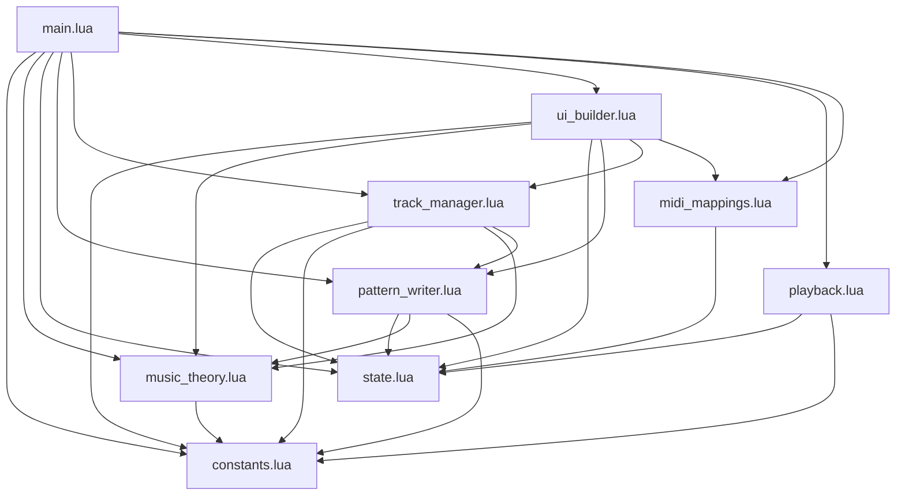

# Requencer Architecture Guide

A comprehensive development guide for the Requencer step sequencer tool for Renoise 3.4.

## Module Overview

```
com.rikis.requencer/
  main.lua           387 lines  Entry point, dialog orchestration, menu registration
  constants.lua       78 lines  Static configuration (sizing, colors, scales, chords)
  state.lua           78 lines  Centralized mutable state singleton
  music_theory.lua   157 lines  Pure functions for notes, scales, chords
  pattern_writer.lua 533 lines  Renoise pattern read/write operations
  track_manager.lua  574 lines  Track lifecycle, visibility, mute, phrase export
  midi_mappings.lua  124 lines  MIDI mapping registration and cleanup
  playback.lua        51 lines  Transport and step indicator management
  ui_builder.lua     668 lines  All ViewBuilder UI construction
  manifest.xml                  Tool metadata and API version
```

## Dependency Graph



No circular dependencies. All arrows point downward in the dependency chain.

## Module Responsibilities

### `constants.lua`
Static configuration that never changes at runtime. Returns a single table.

- UI sizing: `cellSize`, `cellSizeLg`, spacing/margin values
- Color palettes: button colors, row background, step indicator colors
- Music data: `SCALE_INTERVALS`, `CHORD_TYPES`, `KEY_NAMES`
- Options: `num_steps_options`, default pattern length

### `state.lua`
Single source of truth for all mutable application state. Exposed as a shared singleton table -- all modules that `require("state")` get the same instance, so mutations are visible everywhere.

Key fields:
- `vb` -- ViewBuilder instance, created fresh per dialog session
- `sequencer_data` -- Array of row data tables (instrument, notes, states, volumes, delays)
- `track_mapping` -- Maps sequencer row index to Renoise track index
- `track_visibility` -- Note/volume/delay row visibility per track
- `num_steps`, `num_rows` -- Current step and row counts
- `global_octave_range`, `global_scale_mode`, `global_scale_key` -- Musical constraints
- `step_indicators`, `step_grid_view`, `dialog` -- UI view references
- `show_sequencer_dialog` -- Callback set by main.lua (avoids circular dependency)

Helper methods:
- `State:get_track_index_for_row(row_index)` -- Resolve track mapping
- `State:remove_row(index)` -- Remove row from data + visibility
- `State:reset_ui()` -- Clear UI references for fresh dialog
- `State:reset_data()` -- Full data reset for new session

### `music_theory.lua`
Pure functions with zero side effects. All scale/octave/key parameters are passed explicitly.

- `get_available_scales()` -- Query Renoise for scale names
- `get_available_chords()` -- Get chord type names from constants
- `generate_chord_notes(root_note, chord_type)` -- Expand root to chord
- `compute_note_range(base, octave_range)` -- Min/max note for rotary
- `snap_to_scale(note, min, max, scale_mode, scale_key)` -- Constrain to scale
- `percentage_to_note(percent, base, octave_range, scale_mode, scale_key)` -- Rotary to MIDI
- `note_to_percentage(note, base, octave_range)` -- MIDI to rotary
- `note_value_to_string(note)` -- Display format ("C4", "D#3")

### `pattern_writer.lua`
All Renoise pattern read/write operations. This is the data access layer between sequencer state and the Renoise pattern editor. Reads state through `State` module.

- `update_step_note_in_pattern(row, step, note)` -- Write note/chord to pattern
- `update_note_in_pattern(row, step, add_note)` -- Add or remove note
- `update_step_volume_in_pattern(row, step, volume)` -- Set step volume
- `update_step_delay_in_pattern(row, step, delay)` -- Set step delay
- `clear_step_from_pattern(row, step)` -- Clear all note columns for a step
- `write_sequencer_to_pattern()` -- Write entire sequencer to pattern
- `clear_pattern_and_sequencer()` -- Clear everything
- `sync_pattern_to_sequencer()` -- Read pattern into sequencer state + UI
- `load_sequencer_from_pattern()` -- Initialize from existing tracks
- `clear_notes_outside_range(new_steps, current_steps)` -- Cleanup on step count change

### `track_manager.lua`
Renoise track lifecycle management and sequencer row operations.

- Track operations: `setup_default_track_group()`, `find_last_sequencer_track_index()`, `rebuild_track_mapping()`
- Row operations: `remove_sequencer_row(row)`, `remove_sequencer_row_and_track(row)`
- Visibility: `toggle_note_row_visibility(row)`, `toggle_volume_row_visibility(row)`, `toggle_delay_row_visibility(row)`
- Chord mode: `toggle_chord_track(row)`
- Mute: `toggle_track_mute(row)`, `update_mute_button_color(row)`
- Phrase export: `save_row_as_phrase(row)`
- Instrument UI: `get_instrument_names()`, `refresh_instrument_dropdowns()`
- Constraints: `apply_global_note_constraints()` -- Applies octave/scale/key to all rows

### `ui_builder.lua`
All ViewBuilder UI construction. Each function uses `State.vb` and references other modules for event handlers.

- `create_step_indicators(steps)` -- Header row with playback position
- `create_step_row(row_index, steps)` -- Controls + 3-state step buttons (largest function)
- `create_note_row(row_index, steps)` -- Per-step note rotaries
- `create_volume_row(row_index, steps)` -- Per-step volume rotaries
- `create_delay_row(row_index, steps)` -- Per-step delay rotaries
- `create_styled_row_group(row_index, steps)` -- Wraps all row parts in styled container

### `playback.lua`
Transport and step indicator management.

- `update_step_indicators()` -- Highlight current playback step
- `update_play_button()` -- Toggle play/stop icon
- `setup_line_change_notifier()` -- Register document change observer

### `midi_mappings.lua`
MIDI mapping registration and cleanup.

- `cleanup_all_mappings()` -- Remove all known mappings (called on dialog open)
- `register_track_mappings(row_index)` -- Track delay, volume, note CC
- `register_step_note_mapping(row_index, step, rotary_id)` -- Per-step note CC
- `register_step_volume_mapping(row_index, step, rotary_id)` -- Per-step volume CC
- `register_step_delay_mapping(row_index, step, rotary_id)` -- Per-step delay CC

### `main.lua`
Slim orchestration entry point. Wires all modules together.

- `show_sequencer_dialog()` -- Creates dialog, initializes session, registers observers
- `update_step_count(new_steps)` -- Nested function for step count changes
- Menu entry registration

## Data Flow

### User Clicks a Step Button (Off -> Play)

```
1. UI event fires in ui_builder.lua (step button notifier)
2. State update: State.sequencer_data[row].step_states[step] = 1
3. UI update: button text = note_value_to_string(note) via MusicTheory
4. Pattern write: PatternWriter.update_step_note_in_pattern(row, step, note)
   -> Writes note to all pattern lines at step intervals
```

### User Turns a Step Note Rotary

```
1. UI event fires in ui_builder.lua (rotary notifier)
2. MusicTheory converts percentage to constrained note value
3. State update: State.sequencer_data[row].step_notes[step] = note
4. UI update: step button text updated if step is in Play state
5. Pattern write: PatternWriter.update_step_note_in_pattern(row, step, note)
```

### User Changes Global Scale

```
1. UI event fires in main.lua (scale dropdown notifier)
2. State update: State.global_scale_mode = selected_scale
3. TrackManager.apply_global_note_constraints()
   -> For each row and step:
      a. MusicTheory.snap_to_scale() constrains notes
      b. State.sequencer_data updated with constrained values
      c. UI rotaries and buttons updated via State.vb.views
      d. PatternWriter writes constrained notes to pattern
```

### Dialog Opens (Session Initialization)

```
1. main.lua: show_sequencer_dialog()
2. State:reset_ui() clears UI references
3. State.vb = renoise.ViewBuilder() creates fresh instance
4. MidiMappings.cleanup_all_mappings() removes old MIDI maps
5. State:reset_data() clears session data
6. PatternWriter.load_sequencer_from_pattern() tries to load existing tracks
7. If no tracks: create default row + TrackManager.setup_default_track_group()
8. UIBuilder builds all rows: create_styled_row_group() for each row
9. TrackManager.apply_global_note_constraints() ensures notes fit scale
10. PatternWriter.sync_pattern_to_sequencer() syncs pattern -> UI
11. Observers registered: idle, playing, instruments
12. Dialog shown via renoise.app():show_custom_dialog()
```

## State Management

### The Sequencer Data Structure

Each row in `State.sequencer_data` is a table:

```lua
{
  instrument = 1,           -- 1-based instrument index
  note_value = 48,          -- Current track note (MIDI 0-119)
  base_note_value = 48,     -- Base note for rotary range centering
  step_states = {},         -- [step] = 0 (Off), 1 (Play), 2 (Stop)
  step_notes = {},          -- [step] = MIDI note value (per-step override)
  step_volumes = {},        -- [step] = volume (0-127)
  step_delays = {},         -- [step] = delay (0-255)
  track_volume = 100,       -- Track master volume (0-100)
  is_chord_track = false,   -- Chord mode enabled
  chord_type = "None"       -- Active chord type name
}
```

### Track Mapping

`State.track_mapping[row_index]` returns the actual Renoise track index. This indirection exists because sequencer rows may not align 1:1 with Renoise track positions (tracks can be inserted/deleted independently).

### ViewBuilder ID Conventions

All UI elements use deterministic IDs for cross-module access:

- `"instrument_popup_" .. row_index`
- `"chord_toggle_" .. row_index`
- `"chord_popup_" .. row_index`
- `"note_rotary_" .. row_index` (track note)
- `"track_delay_rotary_" .. row_index`
- `"track_volume_rotary_" .. row_index`
- `"note_toggle_" .. row_index` / `"volume_toggle_"` / `"delay_toggle_"`
- `"step_button_" .. row_index .. "_" .. step`
- `"step_note_rotary_" .. row_index .. "_" .. step`
- `"step_volume_rotary_" .. row_index .. "_" .. step`
- `"step_delay_rotary_" .. row_index .. "_" .. step`
- `"mute_button_" .. row_index`
- `"play_stop_button"`, `"steps_dropdown"`, `"scale_mode_dropdown"`, etc.

## Renoise API Patterns

### ViewBuilder

The ViewBuilder (`State.vb`) is created fresh each time the dialog opens to avoid stale ID references. All view construction uses the colon syntax: `vb:row{}`, `vb:button{}`, `vb:rotary{}`, etc.

Views are accessed by ID: `State.vb.views["some_id"]`.

### Observable Notifiers

Renoise uses the observer pattern for reactive updates:

```lua
renoise.song().transport.playing_observable:add_notifier(callback)
renoise.song().instruments_observable:add_notifier(callback)
renoise.tool().app_idle_observable:add_notifier(callback)
renoise.tool().app_new_document_observable:add_notifier(callback)
```

### MIDI Mappings

MIDI mappings are registered via `renoise.tool():add_midi_mapping{}` and removed via `renoise.tool():remove_midi_mapping(name)`. All mappings follow the naming convention: `"Step Sequencer: Row N ..."`.

### Pattern Data Access

```lua
local song = renoise.song()
local pattern = song:pattern(song.selected_pattern_index)
local pattern_track = pattern:track(track_index)
local line = pattern_track:line(line_index)
local note_column = line:note_column(column_index)
```

Note values: 0-119 = notes, 121 = empty. Instrument: 0-based in pattern, 1-based in sequencer data.

## How to Add a New Feature

### Adding a New Per-Step Parameter Row (e.g., Panning)

1. **constants.lua**: No changes needed (unless new colors or sizing).

2. **state.lua**: Add `track_panning_rows = {}` to the State table. Add cleanup in `reset_ui()`.

3. **ui_builder.lua**: Create `UIBuilder.create_panning_row(row_index, steps)` following the pattern of `create_volume_row`. Add it to `create_styled_row_group`.

4. **pattern_writer.lua**: Create `PatternWriter.update_step_panning_in_pattern(row_index, step, panning_value)`.

5. **track_manager.lua**: Add `toggle_panning_row_visibility(row_index)`. Add panning toggle button handling.

6. **midi_mappings.lua**: Add `register_step_panning_mapping(row_index, step, rotary_id)`.

7. **main.lua**: Initialize `step_pannings = {}` in row data. Add panning row to `update_step_count`.

### Adding a New Track-Level Control

1. Add the control in `ui_builder.lua` inside `create_step_row`.
2. Add its MIDI mapping in `midi_mappings.lua`.
3. Add any pattern-writing logic in `pattern_writer.lua`.
4. Store its state in the row data structure within `State.sequencer_data`.

### Adding a New MIDI Mapping

1. Add `register_xxx_mapping(row_index, ...)` in `midi_mappings.lua`.
2. Call it from the appropriate UI builder function.
3. Add cleanup in `cleanup_all_mappings()`.
