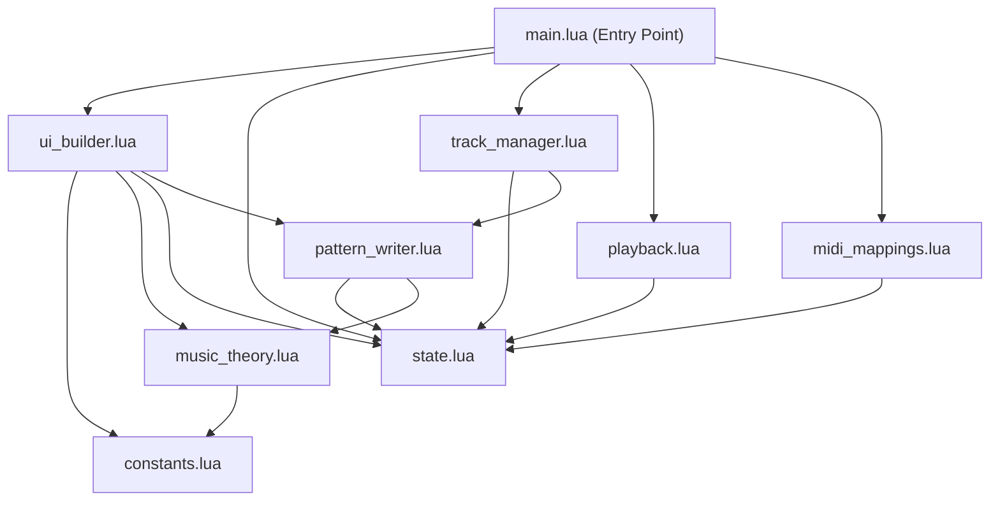

# Refactor main.lua into Clean Code Modules

## Current State

`main.lua` is a single 2786-line file containing all logic: constants, music theory, state management, pattern I/O, track management, UI construction, playback, MIDI mappings, and dialog orchestration. Functions rely on ~20 mutable globals (`vb`, `sequencer_data`, `track_mapping`, `num_steps`, `num_rows`, `step_indicators`, etc.) creating tight coupling and making the code hard to follow.

## Proposed Module Architecture



## Module Breakdown

### 1. `constants.lua` (~70 lines)

All static configuration that never changes at runtime.

- UI sizing: `cellSize`, `cellSizeLg`, spacing/margin constants
- Color palettes: `BUTTON_COLOR_ACTIVE`, `INACTIVE_COLOR`, `ROW_BACKGROUND_COLOR`, etc.
- Music data: `SCALE_INTERVALS`, `CHORD_TYPES`, `KEY_NAMES`, `num_steps_options`
- Returns a single frozen table

**Current locations in main.lua:** lines 1-69, 484-487

### 2. `music_theory.lua` (~120 lines)

Pure functions with zero side effects -- takes inputs, returns outputs.

- `get_available_scales()`
- `get_available_chords()`
- `generate_chord_notes(root_note, chord_type)`
- `compute_note_range(base_note_value, octave_range)`
- `clamp_note(n)`
- `snap_to_scale(note_value, min_note, max_note, scale_mode, scale_key)`
- `percentage_to_note(percent, base_note_value, octave_range, scale_mode, scale_key)`
- `note_to_percentage(note_value, base_note_value, octave_range)`
- `note_value_to_string(note_value)`
- `map_note_to_rotary(note_value, base_note_value)`

**Key change:** Pass `global_octave_range`, `global_scale_mode`, `global_scale_key` as parameters instead of reading globals.

**Current locations in main.lua:** lines 71-234

### 3. `state.lua` (~80 lines)

Single source of truth for all mutable application state, exposed as a table with getter/setter methods.

```lua
local State = {
  sequencer_data = {},
  track_mapping = {},
  track_visibility = {},
  num_steps = 16,
  num_rows = 1,
  current_step = 1,
  is_playing = false,
  is_syncing_pattern = false,
  global_octave_range = 3,
  global_scale_mode = "None",
  global_scale_key = 1,
  -- UI references (set after ViewBuilder creation)
  step_indicators = {},
  dialog = nil,
}
```

- `State:get_row(index)` -- safe accessor
- `State:add_row(data)` -- add with defaults
- `State:remove_row(index)` -- remove and shift
- `State:reset()` -- reset to initial state for dialog re-creation

**Current locations in main.lua:** scattered across lines 15-16, 32-34, 293-327

### 4. `pattern_writer.lua` (~300 lines)

All Renoise pattern read/write operations. This is the data access layer.

- `update_step_note_in_pattern(state, row_index, step, note_value)` (line 1108)
- `update_note_in_pattern(state, row_index, step, add_note)` (line 1185)
- `update_step_volume_in_pattern(state, row_index, step, volume_value)` (line 1013)
- `update_step_delay_in_pattern(state, row_index, step, delay_value)` (line 1047)
- `clear_step_from_pattern(state, row_index, step)` (line 1081)
- `write_sequencer_to_pattern(state)` (line 1232)
- `clear_pattern_and_sequencer(state, vb)` (line 1304)
- `clear_notes_outside_range(new_steps, current_steps)` (line 2283)
- `update_note_delay_value(value, target_track_index)` (line 1257)
- `sync_pattern_to_sequencer(state, vb)` (line 1341)
- `load_sequencer_from_pattern(state)` (line 687)

**Key change:** Accept `state` as first parameter instead of reading globals.

### 5. `track_manager.lua` (~200 lines)

Renoise track lifecycle management.

- `find_last_sequencer_track_index()` (line 601)
- `get_track_index_for_row(state, row_index)` (line 630)
- `rebuild_track_mapping(state)` (line 635)
- `setup_default_track_group(state)` (line 795)
- `remove_sequencer_row(state, vb, row_index)` (line 490)
- `remove_sequencer_row_and_track(state, row_index)` (line 536)
- `toggle_track_mute(state, row_index)` (line 871)
- `update_mute_button_color(state, vb, row_index)` (line 846)
- `save_row_as_phrase(state, vb, row_index)` (line 897)
- `toggle_chord_track(state, vb, row_index)` (line 402)
- `toggle_note_row_visibility(state, vb, row_index)` (line 329)
- `toggle_volume_row_visibility(state, vb, row_index)` (line 350)
- `toggle_delay_row_visibility(state, vb, row_index)` (line 371)
- `get_instrument_names()` (line 2227)
- `refresh_instrument_dropdowns(state, vb)` (line 2236)

### 6. `ui_builder.lua` (~500 lines)

All ViewBuilder UI construction. Returns view objects, does not manage state transitions.

- `create_step_indicators(vb, state, constants, steps)` (line 976)
- `create_step_row(vb, state, constants, row_index, steps)` (line 1457)
- `create_note_row(vb, state, constants, row_index, steps)` (line 1968)
- `create_volume_row(vb, state, constants, row_index, steps)` (line 2057)
- `create_delay_row(vb, state, constants, row_index, steps)` (line 2131)
- `create_styled_row_group(vb, state, constants, row_index, steps)` (line 2204)
- `create_labels_row(vb, constants)` (line 1952)
- `create_controls_row(vb, state, constants, callbacks)` -- toolbar with +, play, clear, sync, dropdowns

**Key change:** Each function receives `vb`, `state`, and `constants` as parameters. Event handlers call into `track_manager` and `pattern_writer` through explicit callbacks or direct requires.

### 7. `playback.lua` (~60 lines)

Transport and step indicator management.

- `update_step_indicators(state)` (line 2261)
- `update_play_button(vb)` (line 2322)
- `setup_line_change_notifier()` (line 2330)
- `trigger_notes(state)` (line 2346)
- `handle_playback(state)` (line 2360)

### 8. `midi_mappings.lua` (~80 lines)

MIDI mapping registration, extracted from `create_step_row` and `create_note_row`.

- `register_track_mappings(vb, row_index)` -- track delay, volume, note mappings (lines 1773-1819)
- `register_step_note_mapping(vb, row_index, step)` (lines 2028-2040)
- `register_step_volume_mapping(vb, row_index, step)` (lines 2102-2114)
- `register_step_delay_mapping(vb, row_index, step)` (lines 2173-2186)
- `cleanup_all_mappings()` -- remove existing to avoid duplicates (lines 2392-2398)

### 9. `main.lua` (~100 lines, down from 2786)

Slim orchestration entry point.

```lua
local Constants = require("constants")
local MusicTheory = require("music_theory")
local State = require("state")
local PatternWriter = require("pattern_writer")
local TrackManager = require("track_manager")
local UIBuilder = require("ui_builder")
local Playback = require("playback")
local MidiMappings = require("midi_mappings")

local function show_sequencer_dialog()
  State:reset()
  MidiMappings.cleanup_all_mappings()
  local vb = renoise.ViewBuilder()
  -- ... wire modules together, build dialog, register notifiers
end

renoise.tool():add_menu_entry {
  name = "Main Menu:Tools:Requencer",
  invoke = show_sequencer_dialog
}
```

## Key Refactoring Principles Applied

- **Single Responsibility**: Each file handles one concern
- **Dependency Inversion**: Modules depend on abstractions (state table), not on global variables
- **Open/Closed**: New row types or pattern operations can be added without modifying existing modules
- **No Global State**: All mutable state flows through the `State` object; `vb` is passed explicitly
- **Pure functions where possible**: `music_theory.lua` and `constants.lua` have zero side effects

## Migration Strategy

Work module-by-module, testing after each extraction:

1. Extract `constants.lua` (safe, no logic)
2. Extract `music_theory.lua` (pure functions, easy to test)
3. Create `state.lua` (centralize globals)
4. Extract `pattern_writer.lua` (heaviest coupling, must update all callers)
5. Extract `track_manager.lua`
6. Extract `midi_mappings.lua`
7. Extract `playback.lua`
8. Extract `ui_builder.lua` (largest chunk)
9. Slim down `main.lua` to orchestration only

## Checklist

- [ ] Extract constants
- [ ] Extract music_theory
- [ ] Create state module
- [ ] Extract pattern_writer
- [ ] Extract track_manager
- [ ] Extract midi_mappings
- [ ] Extract playback
- [ ] Extract ui_builder
- [ ] Rewrite main.lua as slim orchestrator
